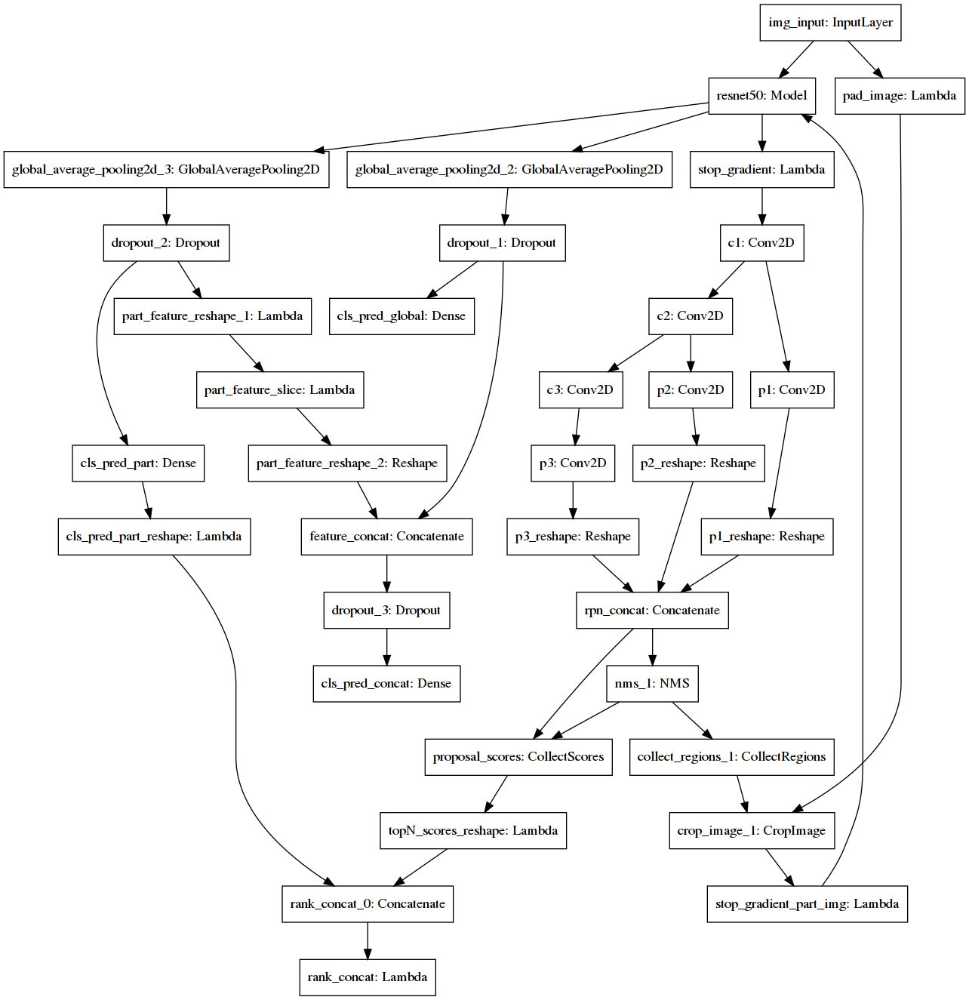

NTS-Net-Keras
This project is a tool to build NTS-Net models, written in Keras.

original paper:[Learning to Navigate for Fine-grained Classification.](https://arxiv.org/abs/1809.00287?context=cs)

## Get [CUB-200-2011](http://www.vision.caltech.edu/visipedia-data/CUB-200-2011/CUB_200_2011.tgz)

## Multi-gpu training is supported

## Quickstart
**Note that currently this project can only be executed in Linux and macOS. You might run into some issues in Windows.**
Python version: python2.7.
1. Download `CUB_200_2011.tgz` and extract the tgz file.
2. Install dependencies by running `pip install -r requirements.txt`.
3. Edit config.py to configure your experiment,you may have to set `data_root`,`num_gpu`,`batch_size` and so on.
4. Run `python train.py` to train a new model.

## Trained model weights

## CUDA version
CUDA 9.0 is required

## performance
Accuracy on test set is 0.82,which is 5 percent lower than the original implementation.PR is welcomed to help slove this problem.

## Acknowledgement

Original implementation
[NTS-Net(https://github.com/yangze0930/NTS-Net),pytorch version.

## Author
He Jian (2314056974@qq.com)

## License
MIT
